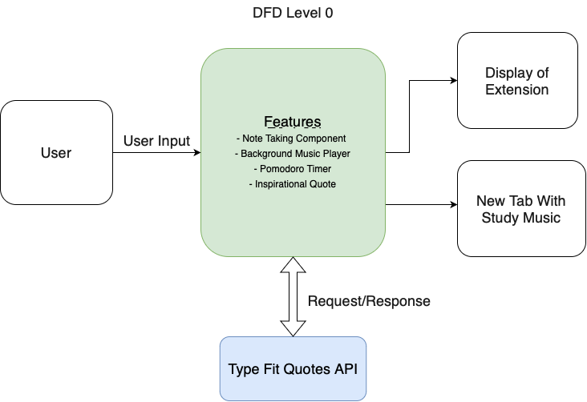

## Our Components
1. Quick note's inside the extension
   - Shall to create new notes 
   - Shall edit old notes 
   - Shall to delete old notes 
   - Has title and description 
2. Music Background Player
   - Will start and pick between study music background noise 
   - Shall display video player on a new tab
   - Easy access for User
3. Pomodoro timer
   -  keep track of study times 
   -  add more study timer habits 
4. Inspirational quote
   - New quote retrieved from a free [API](https://type.fit/api/quotes)

### High-level Design

### Technical Highlights
Setting up the document and code base was a little harder for some of our group as they
they code in macbook pros. Also, implementing our music background player was 
really challenging as youtube does not let us embed a youtube video. Also, playing 
music mp3 files due to api limitations. We decided to go big first, when we should have
started simple components than gradually added harder components to the project
to have a more diverse demo. Working in group's is defensively harder since time 
management is different for everyone, thus working together was a little difficult 
without creating a time management timeline. 

Working on the project, everyone was able to contribute evenly. David was team leader,
so dispersing responsibilities was easier. Working over zoom was definitely harder, as
we couldn't help each other as much as we wanted. In the future, meeting at least once
a week as a group would help a lot. Also, setting soft and hard deadlines for certain
deliverables would help a lot in streamlining the project. 

Triage: 

Final demo 

1. Quick note's 
2. Study timers ( ex. pomodoro ) 
3. Inspirational quotes 
4. Youtube or music background music 
5. Add custom background such rain, cloud , cafe 
6. Screen dimmer 
7. Website restrictions ( most lilely won't be able to complete in time)
8. Try to integrate to reactjs 

